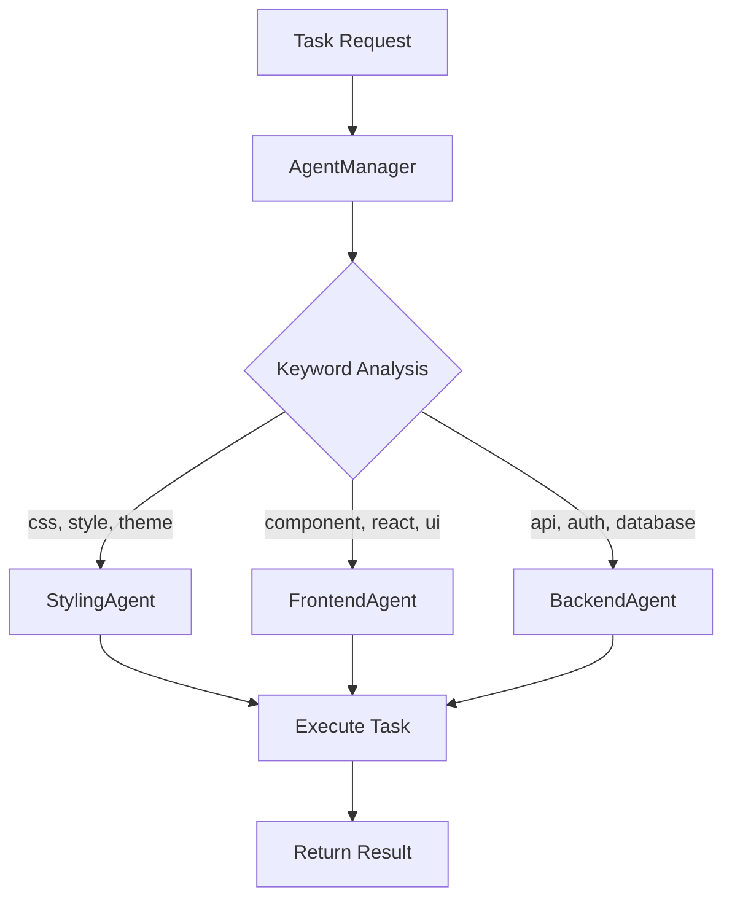

# Gaming Dronzz Website Agents Overview

This document provides a comprehensive overview of the specialized agents available in the Gaming Dronzz website project. These agents are designed to handle specific development tasks following SOLID principles and project standards.

## Agent Architecture

The agent system uses a **Manager-Agent pattern** where:
- **AgentManager**: Routes tasks to appropriate agents based on keywords and specialization
- **Specialized Agents**: Handle domain-specific tasks with expertise in their area

## Available Agents

### 1. AgentManager (`agent-manager.js`)

**Purpose**: Central coordinator that routes tasks to appropriate specialized agents

**Key Features**:
- Intelligent task routing based on keyword analysis
- Collaborative task execution across multiple agents
- Health monitoring of all agents
- Task validation and agent capability matching

**Keywords for Routing**:
- **Styling**: css, style, theme, responsive, mobile, hover, bem, design
- **Frontend**: component, react, jsx, page, route, state, props, ui
- **Backend**: api, endpoint, server, database, auth, middleware, security

**Usage Examples**:
```javascript
const agentManager = new AgentManager();

// Route single task
const result = agentManager.routeTask("Create a responsive navigation component");

// Execute collaborative tasks
const collaborativeResult = agentManager.executeCollaborativeTask([
  { description: "Create user authentication API", context: {} },
  { description: "Build login form component", context: {} },
  { description: "Style the login page with dark theme", context: {} }
]);

// Check agent health
const healthStatus = agentManager.healthCheck();
```

---

### 2. BackendAgent (`backend-agent.js`)

**Specialization**: Server-side development, APIs, databases, authentication

**Core Responsibilities**:
- Create and maintain API endpoints
- Implement authentication and authorization
- Design and manage database schemas
- Handle server-side business logic
- Implement security measures
- Manage data validation and sanitization
- Handle file uploads and processing
- Implement caching strategies
- Monitor performance and logging

**Key Capabilities**:
- RESTful API design with Express.js
- JWT and OAuth authentication
- Database integration (MySQL, PostgreSQL, MongoDB)
- Input validation with express-validator
- Security middleware implementation
- Rate limiting
- Error handling and logging

**Task Types Handled**:
- `create-api`: Generate API endpoints with validation and security
- `setup-auth`: Implement authentication systems
- `setup-database`: Configure database connections
- `create-middleware`: Build custom middleware
- `implement-security`: Add security measures

**Usage Examples**:
```javascript
const backendAgent = new BackendAgent();

// Create secure API endpoint
const apiResult = backendAgent.createAPIEndpoint('users', 'POST', {
  requiresAuth: true,
  validation: [
    { field: 'email', type: 'email', required: true },
    { field: 'password', type: 'string', required: true, minLength: 6 }
  ],
  database: true
});

// Generate authentication middleware
const authMiddleware = backendAgent.createAuthMiddleware('jwt');

// Create database configuration
const dbConfig = backendAgent.createDatabaseConfig('mysql', {
  host: 'localhost',
  database: 'gaming_dronzz',
  port: 3306
});
```

---

### 3. FrontendAgent (`frontend-agent.js`)

**Specialization**: React components, state management, client-side logic

**Core Responsibilities**:
- Create and maintain React components
- Implement SOLID design principles
- Manage component state and props
- Handle client-side routing
- Integrate with backend APIs
- Implement form handling and validation
- Manage authentication and authorization
- Optimize component performance

**Key Capabilities**:
- React functional components with hooks
- Context API implementation
- State management patterns
- Component lifecycle handling
- Event handling and form management
- API integration
- Performance optimization

**Task Types Handled**:
- `create-component`: Generate React components
- `create-page`: Build complete page components
- `implement-routing`: Set up client-side routing
- `add-state-management`: Implement state management
- `integrate-api`: Connect components to APIs

**Usage Examples**:
```javascript
const frontendAgent = new FrontendAgent();

// Create React component
const componentResult = frontendAgent.createReactComponent('UserProfile', 'src/components', {
  props: ['userId', 'onUpdate'],
  state: ['userData', 'loading'],
  hooks: ['useState', 'useEffect'],
  methods: ['updateProfile', 'handleSubmit']
});

// Create context provider
const contextResult = frontendAgent.createContextProvider('Auth', {
  state: ['user', 'isAuthenticated', 'loading'],
  actions: ['login', 'logout', 'updateUser']
});

// Validate SOLID compliance
const validation = frontendAgent.validateSOLIDCompliance(componentCode);
```

---

### 4. StylingAgent (`styling-agent.js`)

**Specialization**: CSS/BEM styling, theming, responsive design

**Core Responsibilities**:
- Create and maintain CSS files using BEM methodology
- Implement chained selectors for specificity
- Organize CSS files alongside components
- Handle responsive design and cross-browser compatibility
- Manage themes and CSS custom properties
- Ensure proper hover states only on interactive elements
- Maintain accessibility compliance in styling

**Key Capabilities**:
- BEM methodology implementation
- CSS custom properties for theming
- Responsive design patterns
- Accessibility-compliant styling
- Cross-browser compatibility
- Performance-optimized CSS

**Task Types Handled**:
- `create-component-styles`: Generate BEM-compliant CSS
- `update-theme`: Modify theme variables
- `fix-responsive`: Address responsive design issues
- `implement-hover-states`: Add appropriate hover effects

**Usage Examples**:
```javascript
const stylingAgent = new StylingAgent();

// Create BEM CSS file
const cssResult = stylingAgent.createCSSFile('UserProfile', 'src/components', {
  block: {
    'display': 'flex',
    'flex-direction': 'column',
    'padding': 'var(--spacing-md)'
  },
  elements: {
    'header': {
      'font-size': 'var(--font-size-lg)',
      'margin-bottom': 'var(--spacing-sm)'
    },
    'avatar': {
      'width': '64px',
      'height': '64px',
      'border-radius': '50%'
    }
  },
  modifiers: {
    'compact': {
      'padding': 'var(--spacing-sm)'
    }
  }
});

// Validate CSS structure
const cssValidation = stylingAgent.validateCSSStructure(cssContent);
```

## Integration with Claude Code

To use these agents with Claude Code's Task tool, you would invoke them through the AgentManager:

```javascript
// Using Task tool to invoke agents
Task.invoke({
  subagent_type: "general-purpose",
  description: "Create user authentication system",
  prompt: `Use the Gaming Dronzz agents to:
    1. Create authentication API endpoints (BackendAgent)
    2. Build login/register components (FrontendAgent)  
    3. Style the authentication forms (StylingAgent)
    
    Follow SOLID principles and BEM methodology as specified in CLAUDE.md`
});
```

## Agent Communication Flow



## Best Practices

### When to Use Each Agent:

**BackendAgent**: 
- Creating APIs and database schemas
- Implementing authentication systems
- Setting up security middleware
- Database operations and queries

**FrontendAgent**:
- Building React components
- Managing application state
- Handling user interactions
- Integrating with APIs

**StylingAgent**:
- Creating component-specific CSS
- Implementing responsive designs
- Managing themes and visual consistency
- Ensuring accessibility compliance

**AgentManager**:
- Complex tasks requiring multiple agents
- Task routing and coordination
- System health monitoring
- Collaborative development workflows

### Integration Guidelines:

1. **Follow SOLID Principles**: All agents are designed to maintain single responsibility and dependency inversion
2. **Maintain BEM Methodology**: StylingAgent enforces proper CSS organization
3. **Component Colocation**: CSS files are created alongside their components
4. **Security First**: BackendAgent includes validation and security by default
5. **Performance Optimization**: All agents consider performance implications

## Configuration

Agents can be configured and extended by:
- Modifying keyword mappings in AgentManager
- Adding new task types to individual agents
- Extending capabilities through inheritance
- Customizing validation rules and standards

This agent system provides a structured approach to development tasks while maintaining code quality and project standards across the Gaming Dronzz website.